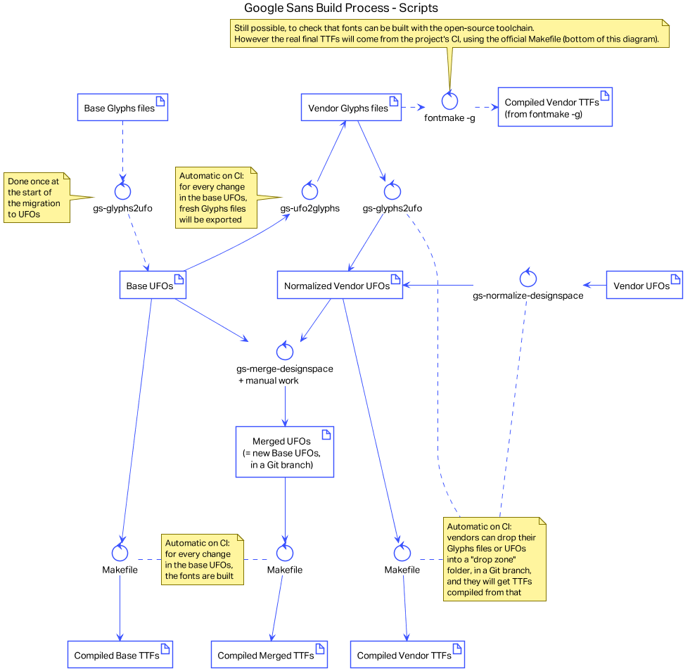
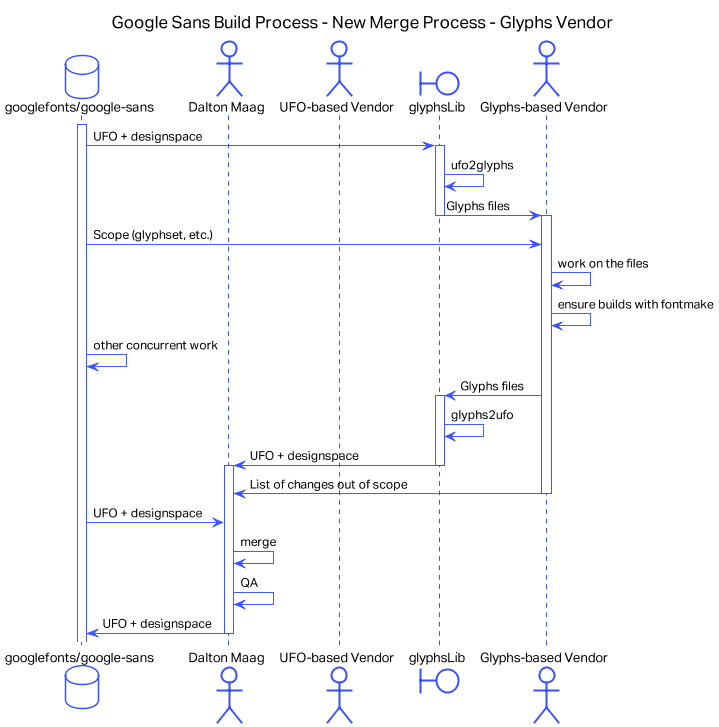
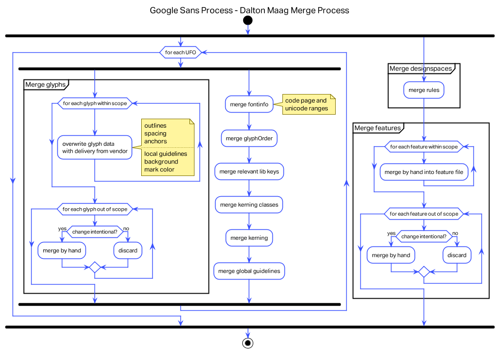
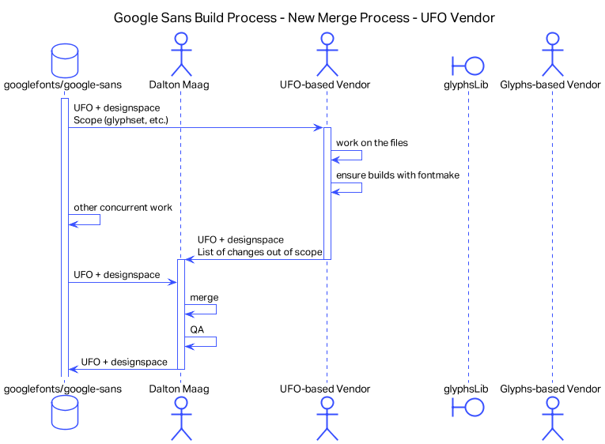
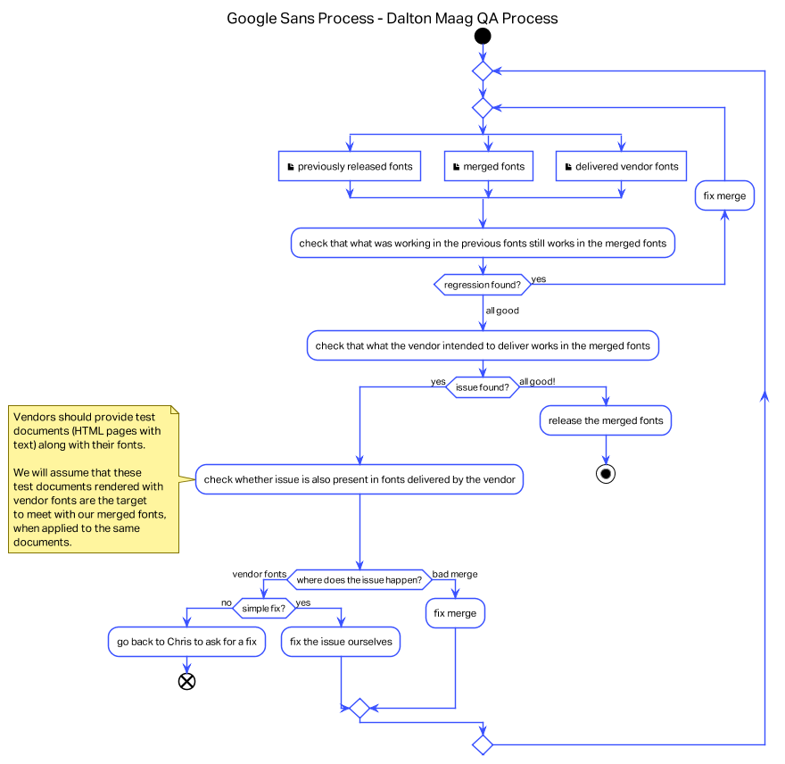

# Google Sans Repository Maintainer Documentation

## Project Dependency Management

The Google Sans typeface build workflow requires the following:

- Python 3.6+ interpreter
- [`fontmake`](https://github.com/googlefonts/fontmake) Python package
- `make`

Optional dependencies for project maintainers include:

- [`pip-tools` Python package](https://github.com/jazzband/pip-tools) - used to maintain the dependencies defined in the `requirements.txt` file

Install the `pip-tools` package with:

```
$ pip3 install --upgrade pip-tools
```

### How to Update Project Dependency Versions

The Python dependencies are defined in the `requirements.txt` file at the root of the repository.  This file is generated from the `requirements.in` file with the `pip-compile` executable, a tool that is part of the free [`pip-tools` Python package](https://github.com/jazzband/pip-tools).

Execute the following command in the root of the project repository to update the depenency version numbers to current release versions:

```
$ pip-compile --upgrade
```

This command is included in a `make` target as a convenience:

```
$ make update-deps
```

The updated `requirements.txt` file should be committed to the git version control history.  Project builders must be aware that this file was updated so that existing venv's can be synchronized with the new version definitions.  The changes will be reflected immediately in any new venv's that are generated as of the `requirements.txt` file change commit.

### How to List Project Dependency Versions Installed in `.venv`

```
$ make list-deps
```

### How to Synchronize Project Dependencies in an Existing `.venv` with Updated `requirements.txt` Definitions

```
$ make sync-deps
```

## Source Conventions

The font sources we receive from vendors are scrubbed with custom scripts and stored as Designspaces and UFOs. The primary objective of the sources is to build the fonts and serve as a base for vendors to split off from to work on new scripts.

Specifically, the sources are normalized to be formatted in the way ufoLib formats sources and contain only:

* Foreground, intermediate (brace) and conditional (bracket) glyphs, no draft or background layers
    * whose metadata (lib keys) contains only semantically relevant data like Glyphs.app's metrics keys, but not color marks.
* Groups and kerning
* Manually merged and arranged features
* Manually maintained font info data
* Automatically managed UFO lib.plist files, that contain:
    * `public.glyphOrder` for determining the order of glyphs in the final fonts
    * `public.postscriptNames` for determining the production glyph names in the final fonts
    * `public.skipExportGlyphs` for listing glyph names that should not be exported to the final fonts
    * `com.github.googlei18n.ufo2ft.filters` for listing filters and their options for compile-time font processing
        * `propagateAnchors`: inherits anchors of base glyphs to their composites automatically to help with building the `mark` and `mkmk` features.
    * `com.schriftgestaltung.customParameter.GSFont.Enforce Compatibility Check` for telling Glyphs.app to always run compatibility checks, not relevant for the build
    * `com.schriftgestaltung.customParameter.GSFont.disablesLastChange` for telling Glyphs.app to not put "last changed" markers into glyphs, which we don't need in the UFO format
    * `com.schriftgestaltung.fontMasterID` for making it easier to match vendor Glyphs.app files to be imported to the target UFOs
* Automatically managed UFO layer layerinfo.plist files, that contain:
    * `com.schriftgestaltung.layerId` for hopefully helping exchange with Glyphs.app.
* Manually managed Designspace `<rules>` for describing conditional (bracket) glyphs
* Automatically managed Designspace instance and global libs, that contain:
    * Instances:
        * `com.schriftgestaltung.customParameters` for carrying build-relevant metadata like PANOSE values
    * Global:
        * `GSDimensionPlugin.Dimensions` for storing Glyphs.app's metadata for stem thicknesses
        * `com.github.googlei18n.ufo2ft.featureWriters` for build-relevant options on how to generate OpenType layout data
        * `public.skipExportGlyphs` for listing glyph names that should not be exported to the final fonts

### Normalizing Sources and Updating GDEF

Normalize the sources (reset formatting, scrub data and remake the GDEF table) with

```
$ python3 scripts/gs-normalize-designspace.py
```

### Conventions for External Vendors

To make merges into the main source base as seamless as possible, vendors should

* Place their source files into the existing `source/GoogleSans/` directory but use different names from the base sources.
* Ideally make no use of intermediate (brace) layers if the design allows it.
* Name all glyphs according to the naming standard used by Glyphs.app and ideally not change them after the first time they've been imported to the base sources.
* Keep the sources buildable with `fontmake`. Various advanced Glyphs.app features are off-limits because the open-source pipeline does not support them, among them smart components.
* Provide a list of glyph names to import into the base sources ([see below](#getting-a-list-of-glyphs-and-kerning-groups)).
* Notify us if they want to change something in the base sources with their sources, as we will screen the changes out otherwise. This includes the names or contents of existing kerning groups or OpenType classes.
* Bundle up test documents for checking the correct shaping of text and application of features, to have tests for functionality after merging.

Additionally, some conventions should be followed for kerning group names and feature code:

* Below, script tags refer to codes in [OpenType Script Tags](https://docs.microsoft.com/en-us/typography/opentype/spec/scripttags) and language tags to [OpenType Language System Tags](https://docs.microsoft.com/en-us/typography/opentype/spec/languagetags).
* Generally, all names should be lowercase (as seen in the examples), separated by underscores, except for what refers to glyph names. E.g. `Omega` should stay as is if it refers to the glyph name.
* OpenType class naming uses the following format:
    * A_B_C_D
    * A - Context-dependent Script system tag - only for Non-Latin scripts
    * B - Context-dependent language system tag
    * C - Context-dependent feature tag
    * D - Class Description string
    * E.g.:
        * C: `pnum`
        * C_D: `pnum_currencies`
        * C_D: `frac_precomposed`
        * A_B_C: `cyrl_bgr_locl`
        * A_C_D_D: `grek_calt_marks_context`

    Lookup naming should use the following format:

    * A_B_C_D
    * A - Context-dependent Script system tag - only for Non-Latin scripts
    * B - Context-dependent language system tag
    * C - Feature tag
    * D - Lookup description string
    * E.g.:
        * B_C_D_D: `rom_locl_cedilla_substitution`
        * A_C_D_D: `grek_ccmp_recompose_dieresistonos`
        * A_B_C_D: `cyrl_bgr_locl_alternates`
        * C_D: `frac_precomposed`

    In general:

    * When a lookup/class is used by several scripts, list all scripts in the name.
    * When a lookup/class is used by several languages, list all languages in the name.
    * When a lookup/class is used in several features, list all feature tags in its name.
    * Except if listing everything is too cumbersome and counterproductive, then drop that part of name but leave a comment instead, just above the lookup/class definition, to explain which scripts/languages/features are concerned
* Kerning groups should contain the name of the script they pertain to. This avoids name clashes. The format is script_key_glyph_or_description, examples: `grek_Omega`, `armn_uc_topround_bottomstraight`, `thai_phoSamphao`.
* Feature code should be organized so that:
    * feature blocks and lookups are declared separately. This makes merging much easier.
    * lookups should have descriptive names and should include, where it makes sense, the language and feature tag where they are used. Example: `nld_locl_ij_substitution` for a netherlandish lookup that replaces `i' j'` by `ij`. See https://docs.microsoft.com/en-us/typography/opentype/spec/languagetags for ISO 639 language tags.

Feature file example:

```
languagesystem DFLT dflt;
languagesystem latn dflt;
languagesystem latn NLD;

@pnum_fig_dflt = [zero one two three four five six seven eight nine];
@pnum_fig_alt = [zero.alt one.alt two.alt three.alt four.alt five.alt six.alt seven.alt eight.alt nine.alt];

lookup pnum_text {
    sub @fig_dflt by @fig_alt;
} pnum_text;

lookup nld_locl_ij_substitution {
    sub i' j' by ij;
    sub I' J' by IJ;
} nld_locl_ij_substitution;

feature pnum {
    lookup pnum_text;
} pnum;

feature locl {
    script latn;
    language NLD;
    lookup nld_locl_ij_substitution;
} locl;
```

#### Getting a List Of Glyphs and (Kerning) Groups

Getting a list of glyph names usually involves selecting everything relevant in the editor and looking for the "copy glyph names" menu entry. The list should be saved to a text file with one line per glyph name and appended to the PR. Example file contents:

```
thai_koKai
thai_thoThung
thai_phoSamphao
```

A glyph list is enough for the import. The import script will grab all kerning groups and pairs that contain any of the imported glyphs.

If you want more control over what groups are imported, you can provide a group list. Getting a group list needs a script, as Glyphs.app and Fontlab name kerning groups differently, making retrieval tedious. For Glyphs.app files, use:

```
$ python3 scripts/gs-print-kerning-groups.py source/GoogleSans/GoogleSansSomeScript.glyphs > import_groups.txt
```

Example file contents:

```
public.kern1.thai_saraE
public.kern1.space
public.kern2.thai_boBaimai
public.kern2.thai_khoKhuat
```

The resulting list in the file `import_groups.txt` should be screened to contain only what should be imported and appended to the PR. The name prefix `public.kern1.` marks groups "to the left" (RTL: right) and `public.kern2.` marks groups "to the right" (RTL: left).

## Workflow

Vendors can use Glyphs.app to work on *.glyphs source files or work directly on UFOs and Designspaces with any editor. Vendors can go off and work on their script and come back once it is ready to be merged or commit their changes regularly to a branch, where we will do the merge process.

glyphsLib is used to generate Glyphs.app files for those who need it.



### Importing a Glyphs.app File



1. Place the vendor's Glyphs.app sources in the `source/GoogleSans/staging/` folder in this repository.

2. Turn the vendor's Glyphs.app sources into UFOs, in the same `source/GoogleSans/staging/` folder:

```bash
python scripts/gs-glyphs2ufo.py source/GoogleSans/staging/*.glyphs
```

Assuming the vendor delivered 2 Glyphs.app source files, uprights and italics, the `gs-glyphs2ufo.py` script will convert both to Designspace + UFOs and place them into the same `source/GoogleSans/staging/` folder.

3. Import the resulting Designspaces into their intended target Designspaces:

```bash
$ python3 scripts/gs-merge-designspace.py \
    --source source/GoogleSans/staging/GoogleSansSomeScript.designspace \
    --target source/GoogleSans/GoogleSans.designspace \
    --import-glyphs-file import_glyphs.txt

$ python3 scripts/gs-merge-designspace.py \
    --source source/GoogleSans/staging/GoogleSansSomeScript-Italic.designspace \
    --target source/GoogleSans/GoogleSans-Italic.designspace \
    --import-glyphs-file import_glyphs_italic.txt
```

(Note: if you also have a group list, specify it as an additional switch like so: `--import-groups-file import_groups_italic.txt`)

4. Extract the features from the staging UFOs and manually merge them into the existing sources. The font info may also need to be updated, chiefly Unicode and codepage ranges.

5. Consider which of the imported glyphs need anchor propagation; edit the list kept in `scripts/internal/normalize.py`

6. Run `scripts/gs-normalize-designspace.py`.



### Importing Designspaces with UFOs

The same as the [Glyphs.app workflow](#importing-a-glyphsapp-file), except we don't convert anything beforehand.



## Quality Assurance

Relies on testing material provided by vendors. Testing material should serve as a reference for how text should look and how features work. For testing, the vendor provided font is swapped with the merged font; if everything stays the same, the test is considered passed.



### Adding and Updating Text Shaping Regression Test Files

To ensure adding and changing feature code does not break existing font functionality, text shaping comparisons are run using HarfBuzz.

The directory `qa/shaping/` contains `.json` files of the following format:

```json5
{
  "input": {
    // Required, a list of strings to shape.
    "text": [
      "GS ĢȘ",
      "ԵԳԶՋԷԾ,;"
    ],
    // Required, a dictionary of features to enable (true) or disable (false).
    // Can be empty.
    "features": {
      "c2sc": true,
      "ss04": true
    },
    // Optional, the ISO 15924 script tag for the text.
    "script": "armn",
    // Optional, the BCP 47 language tag for the text.
    "language": "hy",
    // Optional, the script direction, one of "ltr", "rtl", "ttb" or "btt".
    "direction": "ltr",
    // Optional, the shaping output. Either "full", which includes offsets and
    // advance widths, or "glyphstream" for just the glyph names.
    "comparison_mode": "full"
  },
  "output": {
      // Per font file output goes here...
  }
}
```

The files currently have to be created by hand. Give them a descriptive name, ideally prefixed by the script they pertain to. To fill them with the shaping results of a list of fonts, essentially setting their output in stone, run:

```
$ python3 qa/update_shaping_test_data.py qa/shaping/my_file.json \
    build/GoogleSans/variable/expert/*.ttf build/GoogleSans/static/expert/*.ttf
```

The FontBakery QA tests will pick up the file automatically.
